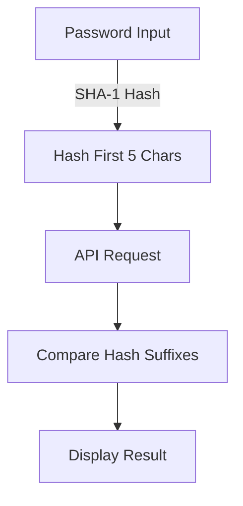

# 🔒 Breach Alert - Password Security Checker


A Chrome extension that helps protect your online security by instantly checking if your passwords have been compromised in known data breaches. Built with privacy in mind, using the HaveIBeenPwned API.


## 🌟 Features

- 🔍 Real-time password checking against the HaveIBeenPwned database
- 🚨 Instant visual alerts when compromised passwords are detected
- 🔐 Privacy-focused: passwords are securely hashed and never stored or transmitted
- 📊 Track statistics of checked passwords and found breaches
- 🌐 Works automatically on any website
- 💫 Simple, clean interface with clear security indicators
- 🎨 Modern, responsive design
- ⚡ Lightweight and fast

## 📋 Table of Contents

- [Installation](#-installation)
- [Usage](#-usage)
- [Development Setup](#-development-setup)
- [How It Works](#-how-it-works)
- [API Reference](#-api-reference)
- [Contributing](#-contributing)
- [Security](#-security)
- [Building](#-building)
- [License](#-license)
- [Acknowledgments](#-acknowledgments)

## 💻 Installation

### Manual Installation (Development)
1. Clone this repository:
   ```bash
   git clone https://github.com/yourusername/breach-alert.git
   ```
2. Navigate to `chrome://extensions/` in Chrome
3. Enable "Developer mode" in the top right
4. Click "Load unpacked"
5. Select the cloned repository directory

## 🎯 Usage

1. The extension works automatically on any website with password fields
2. When you enter a password:
   - 🟢 Green indicator: Password is safe
   - 🔴 Red indicator: Password has been found in data breaches
3. Click the extension icon to view statistics and more information

## 🛠 Development Setup

### Prerequisites
- Node.js (v14 or higher)
- npm (v6 or higher)
- Git

### Setup Steps
1. Fork this repository
2. Clone your fork:
   ```bash
   git clone https://github.com/your-username/breach-alert.git
   ```
3. Install dependencies:
   ```bash
   cd breach-alert
   npm install
   ```
4. Create icon files:
   ```bash
   node convert-icons.js
   ```
5. Load the extension in Chrome (see Manual Installation above)

## 🔧 How It Works

1. When a password is entered, it's securely hashed using SHA-1
2. The first 5 characters of the hash are sent to the HaveIBeenPwned API
3. The API returns a list of hash suffixes that match
4. The extension checks if the full hash exists in the returned list
5. Results are displayed to the user without ever transmitting the full password or hash

### Technical Flow


## 📚 API Reference

### HaveIBeenPwned API
- Base URL: `https://api.pwnedpasswords.com/`
- Endpoint: `range/{first5HashChars}`
- Method: `GET`
- Rate Limit: ~1500 requests per day

For detailed API documentation, visit [HaveIBeenPwned API Docs](https://haveibeenpwned.com/API/v3)

## 🤝 Contributing

Contributions are welcome! Please feel free to submit a Pull Request. For major changes, please open an issue first to discuss what you would like to change.

### Development Process
1. Fork the repository
2. Create your feature branch:
   ```bash
   git checkout -b feature/AmazingFeature
   ```
3. Commit your changes:
   ```bash
   git commit -m 'Add some AmazingFeature'
   ```
4. Push to the branch:
   ```bash
   git push origin feature/AmazingFeature
   ```
5. Open a Pull Request

### Coding Standards
- Use ESLint for JavaScript linting
- Follow the existing code style
- Add comments for complex logic
- Update documentation as needed

## 🔒 Security

### Password Privacy
- Passwords are never stored or transmitted
- Only the first 5 characters of the password hash are sent to the API
- All checking is done client-side
- Uses k-anonymity model for secure password checking


## 🏗 Building

1. Install dependencies:
   ```bash
   npm install
   ```

2. Generate icons:
   ```bash
   node convert-icons.js
   ```

3. Create production build:
   ```bash
   npm run build
   ```

4. The built extension will be in the `dist` directory

## 📄 License

This project is licensed under the MIT License - see the [LICENSE](LICENSE) file for details

## 🙏 Acknowledgments

- [HaveIBeenPwned](https://haveibeenpwned.com/) for providing the API
- [Chrome Extensions Documentation](https://developer.chrome.com/docs/extensions/)

---

Made with ❤️ by [Aditya Kumar Singh](https://github.com/adiaparmar)

### Support

If you found this project helpful, please consider:
- ⭐ Starring the repository
- 🔀 Creating a fork
- 📢 Sharing with others

For support, email adiaparmar@gmail.com or open an issue.
